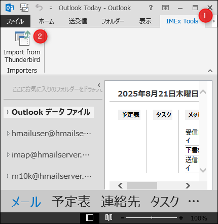
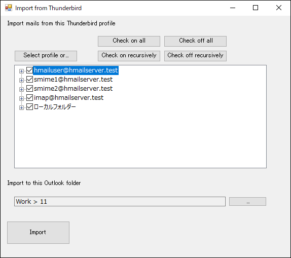
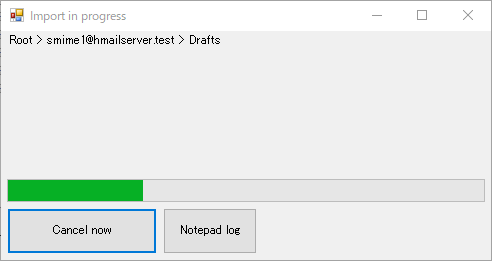
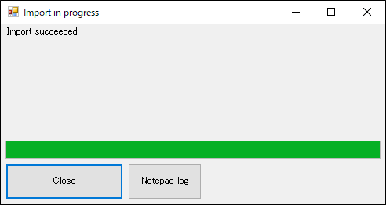

# OutlookIMExToolsAddIn1

Import mails to Microsoft Office Outlook.

This is a VSTO add-in. (Built on `net472`)

## Usage

Install `Setup_OutlookIMExToolsAddIn1.exe` and also VSTO add-in.

Launch Microsoft Office Outlook.

Open `IMEx Tools` tab.

## Import mails from Thunderbird

Click `Import from Thunderbird` button.

Click `Select profile or...` button to pick up a Thunderbird profile folder.

And also check the location of `Import to this Outlook folder`.

Clicking `Import` will begin import process.

Fortunately it is `Import suceeded!` in this case.

The mails will be imported.
